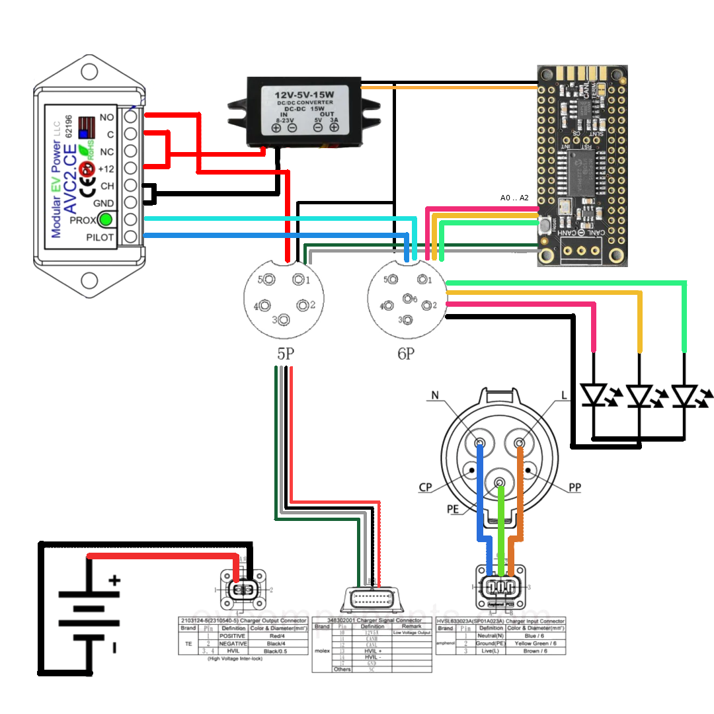

# pao_charger
Pao charging logic, to be used with Elcon tc charger to provide can bus messages for charging as well as minimal outout via led pins

# LED states
init - green and red high, amber low

error: amber is high, red blinking 

number of blinks: 

1 - hardware error

2 - overheating

3 - input voltage not allowed

4 - battery not connected

5 - CAN bus error

6  - No input voltage

charge state
less than half: red blinking
over half, under under nominal voltage: red high, amber bliking
over nominal, under 90%: red, amber high. green blinking
over 98%: all high

# Schematic

# Wiring